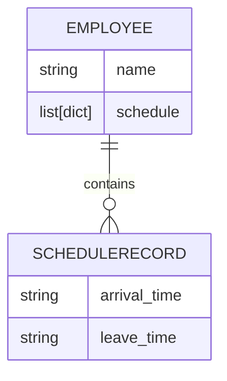

# Exercise
The company ACME offers their employees the flexibility to work the hours they want. But due to some external circumstances they need to know what employees have been at the office within the same time frame

The goal of this exercise is to output a table containing pairs of employees and how often they have coincided in the office.

Input: the name of an employee and the schedule they worked, indicating the time and hours. This should be a .txt file with at least five sets of data. You can include the data from our examples below:

Example 1:

INPUT
RENE=MO10:00-12:00,TU10:00-12:00,TH01:00-03:00,SA14:00-18:00,SU20:00- 21:00
ASTRID=MO10:00-12:00,TH12:00-14:00,SU20:00-21:00
ANDRES=MO10:00-12:00,TH12:00-14:00,SU20:00-21:00


OUTPUT:
ASTRID-RENE: 2
ASTRID-ANDRES: 3
RENE-ANDRES: 2

Example 2:

INPUT:
RENE=MO10:15-12:00,TU10:00-12:00,TH13:00-13:15,SA14:00-18:00,SU20:00-21:00
ASTRID=MO10:00-12:00,TH12:00-14:00,SU20:00-21:00

OUTPUT:
RENE-ASTRID: 3

# Solution overview

The exercise prompts us with a set of employee names, followed by coma separated groups of dates and times indicating when the employees were present in the office. The objective of the exercise is to compute the ammount of times the employees coincided in the office. This computation was performed by checking if any "overlap" exists between the schedules for every employee, and this is the word that's going to be used from this point forwards to refference this coincidence.


## Solution outline
Based on the previous description, I've decided to create two models to abstract both the "employees" and their "schedules".
These models are called "Employee" and "ScheduleRecord" respectively.

```python
@dataclass
class ScheduleRecord:
    day: str
    arrival_time: str
    leave_time: str

@dataclass
class Employee:
    name: str
    schedule_records: List[ScheduleRecord]
```

The Employee model has a "name" property, which contains a string, and a "schedule_records" property, which initially contained a list of "ScheduleRecord" objects. With this approach, computing the schedule overlaps requires iterating over every ScoreRecord for every employee, this has a cost of O(n^2) which is not the most efficient way to do it.

To tackle this performance issue, the list was replaced by a dictionary. The dictionary's keys are now the days of the week of each "ScheduleRecord" and the values are the "ScheduleRecords" themselves.

```python
@dataclass
class ScheduleRecord:
    arrival_time: str
    leave_time: str

@dataclass
class Employee:
    name: str
    schedule_records: Dict[str, ScheduleRecord]
```

```python
{"MO": ScheduleRecord, "TU": ScheduleRecord...}
```

Now, when comparing schedules we just have to verify if the same key exists in the schedules of other employees which takes constant time "O(1)".


## Project architecture

For the purpose of making this project easily extensible and scalable, SOLID principles were implemented in the design of this application.

### Design pattern
In order to solve this problem, the MVC (Model View Controller) design pattern was used because it allows for a good sepparation of concerns.

The logic for parsing the data, generating the reports, and rendering it out so the users can see the output was handled by different classes and methods, thus, following the "Single Responsability Principle" as you will see in the following sections.


### Models
Records in the text file are parsed into objects of type "Employee" which contains a dictionary with a key for each day of the week found in the record. The values assigned to these keys are objects of type "ScheduleRecord" which contains two string attributes:
- arrival_time
- leave_time 

The following graphic contains the entity relationship diagram for the "Employee" and "ScheduleRecord" models:



## Controllers

### Parsers
To parse the data contained in the text file, two classes were created.

```python
class FileParser(ABC):
    def __read_file(path:str):
        pass

    def parse(path: str):
        pass

class EmployeeScheduleParser(FileParser):
    def __read_file(path:str):
        # Concrete implementation

    def parse(path: str):
        # Concrete implementation

```

The first class "FileParser" is an "abstract base class". It just contains the definition of it's methods. It serves as a contract for other sub-classes which extend from it.

The second class "EmployeeScheduleParser" extends from "FileParser" but it contains a concrete implementation for both the "__read_file" and "parse" methods.

The reason for this is to allow for an easy extensibility of the application, so, in the future, if we want to support another file type other than "txt" like "json" or "xml" we just have to extend the "FileParser" class and create concrete implementations for each file type. This way we don't have to depend on concrete implementations in other parts of our application, we just need to know that we're working with a "FileParser" to know we have the "parse" method available.

### Reports
Just like with parsers, two classes were created to generate the reports:

```python
class EmployeeReport(ABC):
    def __init__(self, parser: FileParser) -> None:
        self.parser = parser
    
    
    def generate(self, path: str) -> List[Tuple[str, int]]:
        pass


class ScheduleOverlapReport(EmployeeReport):
    def generate(self, path: str) -> List[Tuple[str, int]]:
        # Concrete implementation
```

The first class is an "Abstract Base Class" and the second one inherits from it. 

The "generate" method overrides the parent class but this time with a concrete implementation.

These reports return lists of touples with a string as it's first item and an integer as it's second one. This list is later going to be used in a renderer to be displayed to the users.

This appoproach allows us to create different types of reports in the future in a consistent manner without breaking other parts of our app.


## Views

### Renderers
Although this application currently does not have a GUI(Graphical User Interface), it has a "ConsoleRenderer" which extends from the "ReportRenderer" class.

```python
class ReportRenderer(ABC):
    def render(report: List[Tuple[str, int]]):
        pass


class ConsoleRenderer(ReportRenderer):
    def render(self, report: List[Tuple[str, int]]):
        # Concrete implementation
```

Instances of "ReportRenderer" and it's sub-classes have a method called "render" that contains all of the logic needed for rendering the report.

In the future, we were to implement a GUI to display the report, we just have to extend the "ReportRenderer" class and create a concrete implementation of the "render" method that fulfills the desired output.

# Running the project

## Requirements
- Python version (3.10.0+)
- Linux environment

## Instructions

Before you follow these instructions, on your terminal, cd into an empty folder.

### Create a virtual environment

Linux
```bash
python -m venv ./venv
```

### Activate the virtual environment
Linux
```bash
source ./venv/bin/activate
```

### Install dependencies
Linux | Windows
```bash
pip install
```

### Run tests
Linux | Windows
```bash
pytest
```

### Run app
Linux | Windows
```bash
python main.py
```